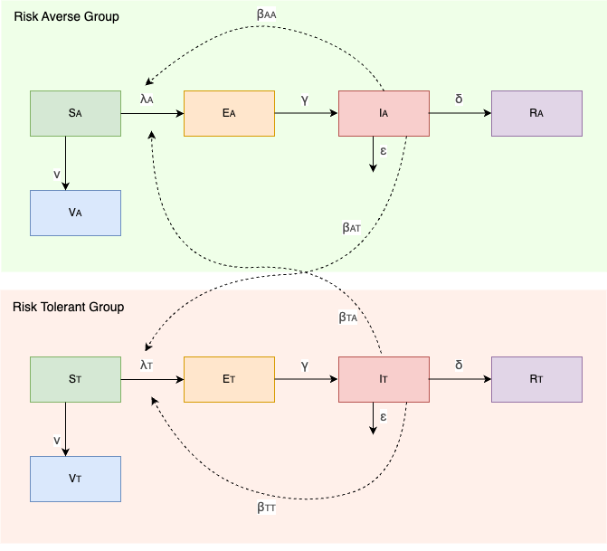
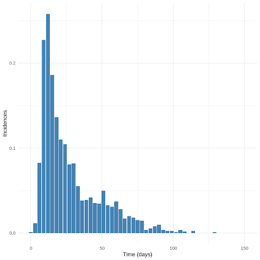
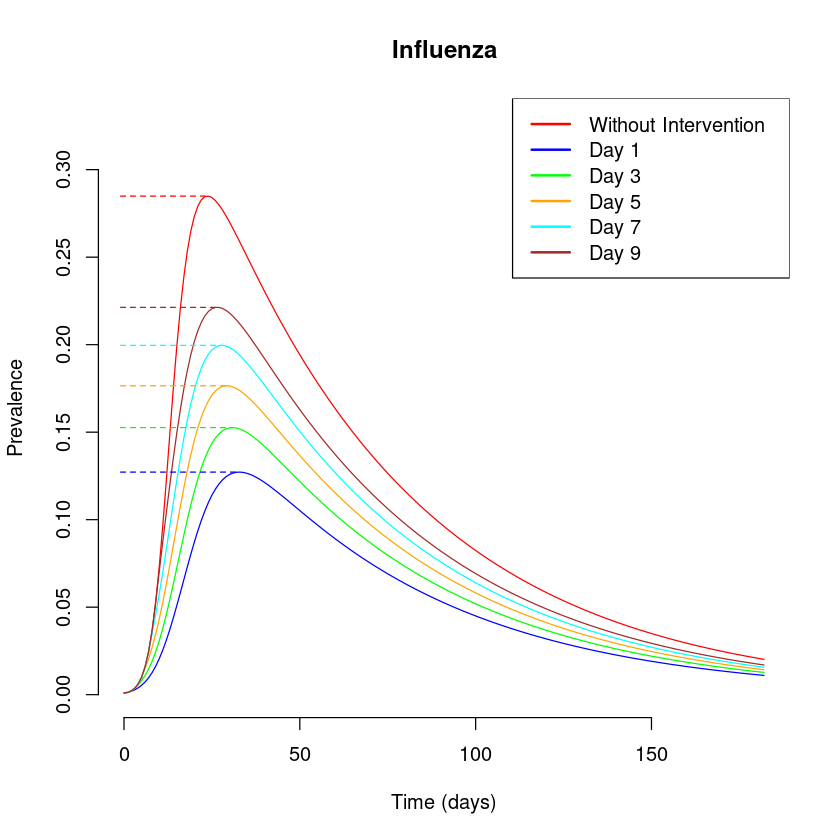

# Modelling Mask-wearing Behaviour in Influenza


This epidemiology project was completed as part of the [MMED 2024](https://www.ici3d.org/MMED), 
a two-week modeling clinic that focuses on using data to understand infectious disease dynamics
and modeling.

## 1. Introduction

### 1.1 Overview

When facing an infectious disease, individuals attempt to emphasize different responses. 
This is based in part on their perceived risk. This project aims to understand the 
transmission dynamics of the flu in the population subdivsed in two group: risk averse 
and risk tolerant. The risk averse group will wear a mask as the prevalence increases 
while risk tolerant group will never wear a mask. Both of these sub-groups interact 
and mix with each other. In order to model the human behavior regarding the influenza 
outbreak, a compartimental model is developed. It is a combination of two SEIRV 
(Susceptible - Exposed - Infectious - Recovered - Vaccination) models where 
the mask-wearing effect is considered through the forces of infection.

### 1.2. Research question

What is the latest time for mask-wearing intervention to achieve a 30% reduction 
in the peak of influenza infection, taking into consideration the different 
beliefs in masks in the population?

### 1.3. Objectives

1. **Understand Transmission Dynamics:** Analyze the transmission dynamics of the
flu in a population subdivided into two groups.

2. **Model Human Behavior:** Develop a compartmental model to simulate human behavior
 during an influenza outbreak, incorporating the differing responses of the two groups
 to perceived risk.

3. **Assess Impact of Mask-Wearing:** Evaluate the impact of mask-wearing behavior on
the spread of the disease, specifically examining how the prevalence of flu changes
based on the protective measures adopted by the risk-averse group.


## 2. Methodology

### 2.1 Model

#### Model description

In this study we have used an adapted SEIRV model in order to incorporate human 
behaviour (see figure below). The model accounts for the each sub-groups, a risk
averse group and a risk tolerant group ($A$ and $T$). Each group progresses 
through the stages of Susceptible (S), Vaccinated (V), Exposed (E), Infectious (I),
and Recovered (R). Individuals in the Susceptible compartment can either get vaccinated
or become exposed to the infection, moving to the Exposed compartment. From there, 
they may transition to the Infectious stage and subsequently either recover or 
succumb to the disease.

<div style="text-align: center;">
  
</div>

#### Model assumptions
  - Infectious individuals from either group can infect individuals in either of 
  the susceptible populations
  - Everyone is susceptible to infection initially
  - Once a person is vaccinated, he is immune for the duration
  - After being infected people can either recover at a rate of $\delta$ or
   die from influenza
  - $20$% of infectious are considered as new cases

#### Model parameters
The transmission rates $\beta_{AA}$, $\beta_{TA}$, $\beta_{TT}$, and $\beta_{AT}$ define 
how disease spread within and between the risk-averse and risk-tolerant groups. 
Additional parameters such as vaccination rate ($\nu$), transition rate from exposed 
to infectious ($\gamma$), recovery rate ($\delta$), and death rate ($\epsilon$) 
further define the dynamics of the disease spread.

#### Mask-wearing effect

The effect of mask-wearing is included to the model via the forces of infection
which account for interaction between and whithin the groups. They are 
defined as follows:
 - in risk averse model by:

$$
 \begin{aligned}
\lambda_A &= \beta_{AA} \cdot \exp\left( - a \times \frac{1}{5} \times \frac{I}{N} \right)\cdot \frac{I_A}{N_A} + \beta_{TA} \cdot \exp\left( - c \times \frac{1}{5} \times \frac{I}{N} \right)\cdot\frac{I_T}{N_T}
\end{aligned}
$$

 - in risk tolerant model by:

$$
\lambda_T = \beta_{TT} \frac{I_T}{N_T} + \beta_{AT}  \cdot \exp\left( - c \times \frac{1}{5} \times \frac{I}{N} \right)\cdot\frac{I_A}{N_A}  
$$

where $a$ and $c$ determine how rapidly transmission declines as a function of prevalence of infection.


### 2.2 Data

In this project, we simulated data to answer our reasearch questions. For this purpose, 
first with the initial values of the model parameters, we simulate an Influenza outbreak
for 3 months. Second, we measure new cases by drawing cross-sectional samples of $N_{\text{sam}}$
individuals at each three-day interval, testing them for the presence of Influenza and computing the 
proportion of new cases. For test, the probability of sucess at the day $t$ corresponds to the 
$\frac{I_A(t)+I_T(t)}{N_A+N_T}$. And the proportion of new cases is given by the number of successes
over the $N_sam$. The figure shows the distribution of the new cases of Influenza generated 
against the time.

<div style="text-align: center;">
  
</div>

### 2.3 Parameter estimation

Since the data is sampled from binomial process, the model parameters are estimated using
the binomial likelihood.

For a given time $t$, the probability $k$ new cases out of the suscitible is given by the binomial distribution:

$$
P(k|beta_{*}) = C_{S_A+S_T} ^ {k} \times p^ k (1-p)^{S_A+S_T - k}
$$
where $p = \frac{1}{5} \times \left(\beta_{AA} + \beta_{TA}\right)\frac{I_A}{N_A} +  \left(\beta_{TT} + \beta_{AT}\right)\frac{I_N}{N_T}$.

To fit the model to data, we find the model parameters by maximuzing the log-likelihood.  


### 2.4 Interventions

To be able to intervene, we include an intervention factor.
We suppose that mandates to each group to wear mask reduced the outbreak to $50$%.
Thus, the forces of infection considering the intervention is given:
 - in risk averse model by:

$$
 \begin{aligned}
\lambda_A &= \beta_{AA} \cdot \exp\left( - a \times \frac{1}{5} \times \frac{I}{N} \right)\cdot \frac{I_A}{N_A} + \beta_{TA} \cdot \exp\left(- c \times \frac{1}{5} \times \frac{I}{N} \right)\cdot\frac{I_T}{N_T} \times z(t)
\end{aligned}
$$

 - in risk tolerant model by:

$$
\lambda_T = \left[\beta_{TT} \frac{I_T}{N_T} + \beta_{AT}  \cdot \exp\left( - c \times \frac{1}{5} \times \frac{I}{N} \right)\cdot\frac{I_A}{N_A}  \right]\times z(t)
$$

where 
$
z(t) = \begin{cases}
1 \text{ $t<\tau$} \\
0.5 \text{ otherwise} 
\end{cases}
$

and $\tau$ is the intervention day.


## 3. Results

The figure below shows the change over time of the number of new cases for different
 intervention days.


<div style="text-align: center;">
  
</div>

As expected, implementing the intervention early of the outbreak will drastically 
reduce the the number of cases. To reduce the peak of infection by 30% we have to 
implement the mandate exactly a week after the first infection case is reported.

## 4. Conclusion

To summarize, enforcing mask-wearing mandate to 30% of the population a week 
after influenza outbreak reduces the incidence peak from 0.28 to 0.20 
corresponding to a 30% reduction in the peak. Our results show that an early 
intervention is important in reducing the peak number of cases.


## 5. Repository Contents

## 6. Usage

- Clone the repository:
   ```bash
   git clone https://github.com//clemsadand/MMED-Group7/

## 7. Authors
- [Chaelin](https://github.com/ckim0509)
- [Clément](https://github.com/clemsadand)
- [Damaris](https://github.com/damariskimonge)
- [Dean](https://github.com/D3lt4-783)
- [Ingrid](https://github.com/IngridThandeka)
- [Rivado](https://github.com/RivaldoMessia)

## Acknowlegment

We would like to extend our deepest gratitude to [MMED 2024](https://www.ici3d.org/MMED) and our 
supervisor for their invaluable guidance, support, and encouragement 
throughout this project.


