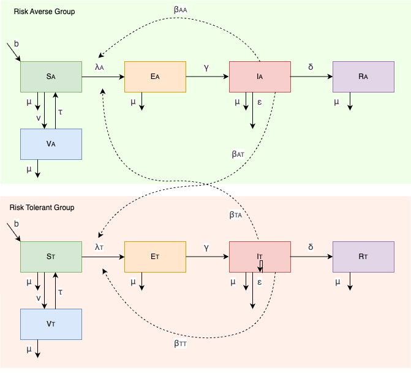

# Modelling Human Behavior

This epidemiology project was completed as part of the [MMED 2024](https://www.ici3d.org/MMED), 
a two-week modeling clinic that focuses on using data to understand infectious disease dynamics
and modeling.

## Overview

When facing an infectious disease, individuals attempt to emphasize different responses. 
This is based in part on their perceived risk. In this project aims to understand the 
transmission dynamics of the flu in the population subdivsed in two group: risk averse 
and risk tolerant. The risk averse group will wear a mask as the prevalence increases 
while risk tolerant group will never wear a mask. Both of these sub-groups interact 
and mix with each other. In order to model the human behavior regarding the influenza 
outbreak, a compartimental model is developed. It is a combination of two SEIRV 
(Susceptible - Exposed - Infectious - Recovered - Vaccination) models.

<div style="text-align: center;">
  
</div>

## Objectives

1. **Understand Transmission Dynamics:** Analyze the transmission dynamics of the
flu in a population subdivided into two groups.

2. **Model Human Behavior:** Develop a compartmental model to simulate human behavior
 during an influenza outbreak, incorporating the differing responses of the two groups
 to perceived risk.

3. **Assess Impact of Mask-Wearing:** Evaluate the impact of mask-wearing behavior on
the spread of the disease, specifically examining how the prevalence of flu changes
based on the protective measures adopted by the risk-averse group.

## Methodology

## Results

## Repository Contents

## Usage

- Clone the repository:
   ```bash
   git clone https://github.com//clemsadand/MMED-Group7/

## Authors

## Acknowlegment


